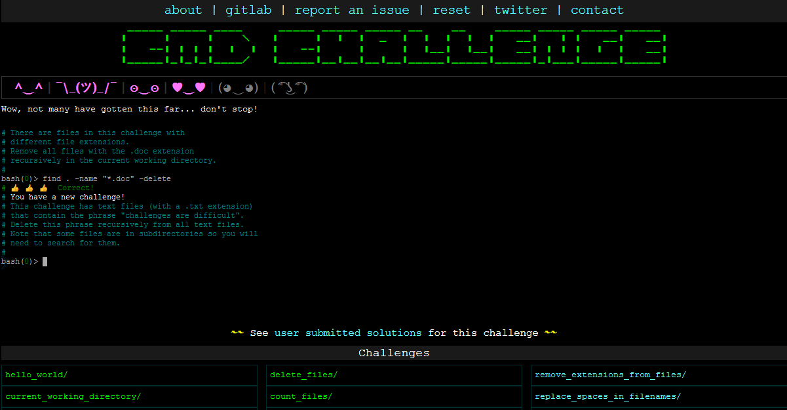

# cmdchallenge

Ce repo contien *mes* solutions au [Commandline Challenge](https://cmdchallenge.com/)



#### hello world
```bash
$ echo "hello world"
```

#### current_working_directory
```bash
$ pwd
```

#### list_files
```bash
$ ls
```

#### print_file_contents
```bash
$ cat access.log
```

#### last_lines
```bash
$ tail -n 5
```

#### find_string_in_a_file
```bash
$ grep GET access.log
```

#### search_for_files_containing_string
```bash
$ grep -Rl 500
```

#### search_for_files_by_extension
```bash
$ find . -name "access.log*"
```

#### search_for_string_in_files_recursive
```bash
$ find . -name "access.log*" | xargs grep -h 500
```

#### extract_ip_addresses
```bash
$ find . -name "access.log*" | xargs grep -Eo '^[^ ]+'
```
L'expression reguliere signifie en debut de fichier et tout ce qui n'est pas un espace 

#### delete_files
```bash
$ find . -delete
```

#### count_files
```bash
$ ls -l | wc -l
```

#### simple_sort
```bash
$ sort access.log
```

#### count_string_in_line
```bash
$ grep -c GET access.log
```

#### split_on_a_char
```bash
$ cat split-me.txt | sed 's/\;/\n/g'
```

#### print_number_sequence
```bash
$ echo {1..100}
```

#### remove_files_with_extension
```bash
$ find . -name "*.doc" -delete
```

#### replace_text_in_files
```bash
$ find . -name "*.txt" -exec sed -i 's/challenges are difficult//g' {} +
```

#### sum_all_numbers
```bash
$ cat sum-me.txt | xargs | sed 's/ /+/g' | bc
```

#### just_the_files
```bash
$ find . -type f -printf "%f\n"
```

#### remove_extensions_from_files
```bash
$ rename 's/\.//' **
```

#### replace_spaces_in_filenames
```bash
$ ls | tr ' ' .
```

#### dirs_containing_files_with_extension
```bash
$ find . -type f -name "*.tf" -printf "%h\n" | uniq
```

#### files_starting_with_a_number
```bash
$ find . -name '[0-9]*' -type f -printf "%f\n"
```

#### print_nth_line
```bash
$ sed -n '25p' faces.txt
```
sed -n 'Xp' theFile, where X is your line number and theFile is your file.

#### reverse_readme
```bash
$ tac README
```


#### disp_table
```bash
$ cat table.csv | column -t -s,
```
